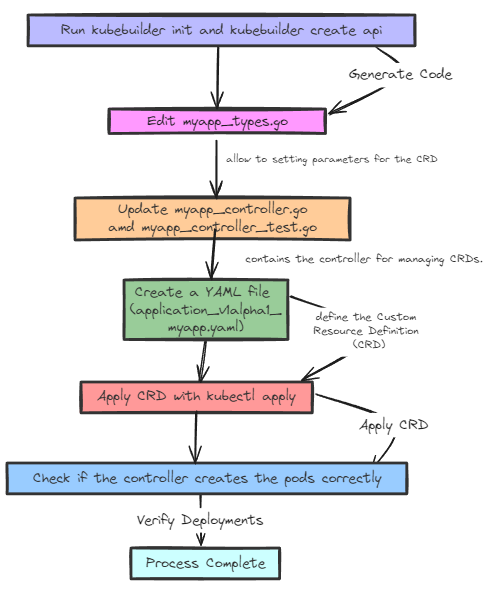

## Implementing the Controller Logic. 

 
To create custom pods using the controller, we need to modify the following files in our project directory:

1) myapp_controller.go
2) myapp_controller_test.go
3) application_v1alpha1_myapp.yaml
4) myapp_types.go 

~~~
.
|-- Dockerfile
|-- Makefile
|-- PROJECT
|-- README.md
|-- api
|   `-- v1alpha1
|       |-- groupversion_info.go
|       `-- myapp_types.go
|-- bin
|   |-- controller-gen -> /root/operator/bin/controller-gen-v0.16.1
|   |-- controller-gen-v0.16.1
|   |-- kustomize -> /root/operator/bin/kustomize-v5.4.3
|   `-- kustomize-v5.4.3
|-- cmd
|   `-- main.go
|-- config
|   |-- crd
|   |   |-- bases
|   |   |   `-- application.nbfc.io_myapps.yaml
|   |   |-- kustomization.yaml
|   |   `-- kustomizeconfig.yaml
|   |-- default
|   |   |-- kustomization.yaml
|   |   |-- manager_metrics_patch.yaml
|   |   `-- metrics_service.yaml
|   |-- manager
|   |   |-- kustomization.yaml
|   |   `-- manager.yaml
|   |-- network-policy
|   |   |-- allow-metrics-traffic.yaml
|   |   `-- kustomization.yaml
|   |-- prometheus
|   |   |-- kustomization.yaml
|   |   `-- monitor.yaml
|   |-- rbac
|   |   |-- kustomization.yaml
|   |   |-- leader_election_role.yaml
|   |   |-- leader_election_role_binding.yaml
|   |   |-- metrics_auth_role.yaml
|   |   |-- metrics_auth_role_binding.yaml
|   |   |-- metrics_reader_role.yaml
|   |   |-- myapp_editor_role.yaml
|   |   |-- myapp_viewer_role.yaml
|   |   |-- role.yaml
|   |   |-- role_binding.yaml
|   |   `-- service_account.yaml
|   `-- samples
|       |-- application_v1alpha1_myapp.yaml
|       `-- kustomization.yaml
|-- go.mod
|-- go.sum
|-- hack
|   `-- boilerplate.go.txt
|-- internal
|   `-- controller
|       |-- myapp_controller.go
|       |-- myapp_controller_test.go
|       `-- suite_test.go
`-- test
    |-- e2e
    |   |-- e2e_suite_test.go
    |   `-- e2e_test.go
    `-- utils
        `-- utils.go
~~~
